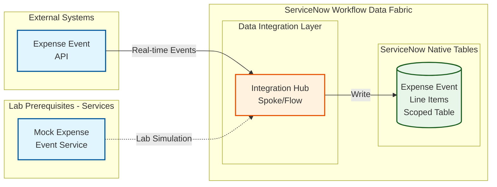

# Fundamentals
### Data Flow

```mermaid
graph LR
    subgraph "ServiceNow Workflow Data Fabric"
        subgraph "Data Integration Layer"
            IntHub[Integration Hub<br/>Spoke/Flow]
        end

        subgraph "ServiceNow Native Tables"
            ExpenseTable[(Expense Event<br/>Line Items<br/>Scoped Table)]
        end
    end

    subgraph "External Systems"
        ExpenseAPI[Expense Event<br/>API]
    end

    subgraph "Lab Prerequisites - Services"
        MockExpense[Mock Expense<br/>Event Service]
    end

    %% Data Flow Connections
    ExpenseAPI -->|Real-time Events| IntHub
    MockExpense -.->|Lab Simulation| IntHub
    IntHub -->|Write| ExpenseTable

    %% Styling
    classDef external fill:#e1f5ff,stroke:#01579b,stroke-width:2px
    classDef integration fill:#fff3e0,stroke:#e65100,stroke-width:2px
    classDef native fill:#e8f5e9,stroke:#1b5e20,stroke-width:2px

    class ExpenseAPI external
    class IntHub integration
    class ExpenseTable native
    class MockExpense external
```
