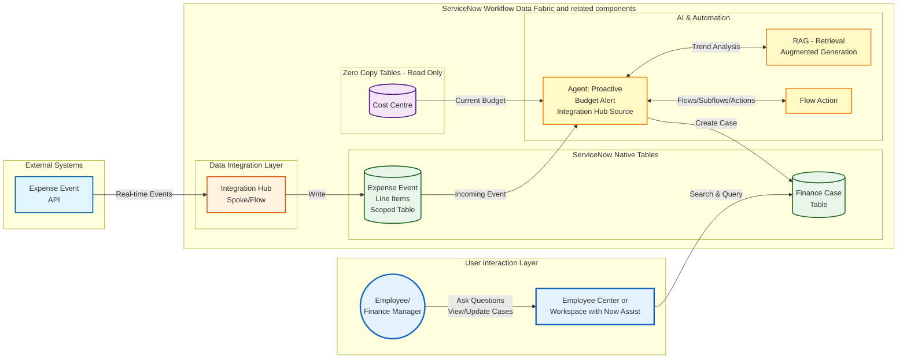
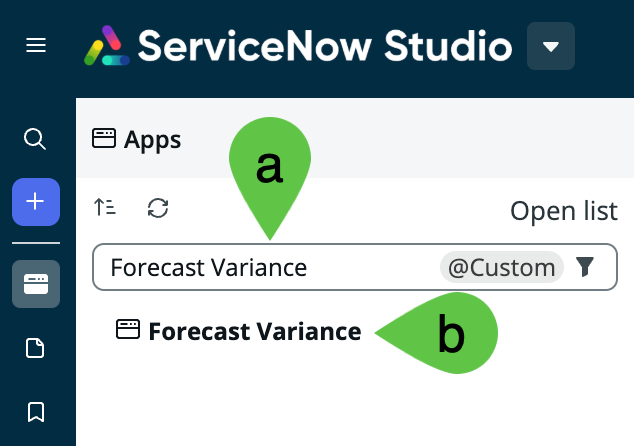
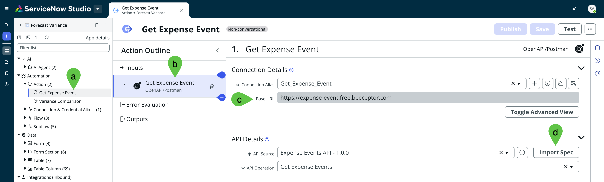
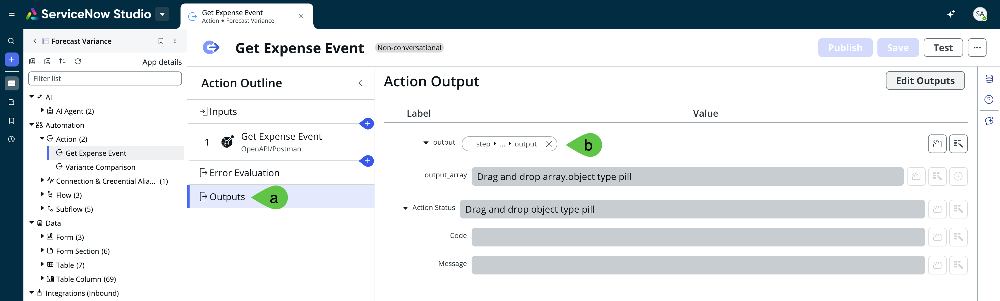
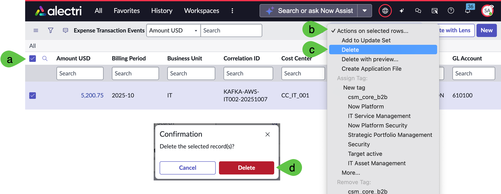
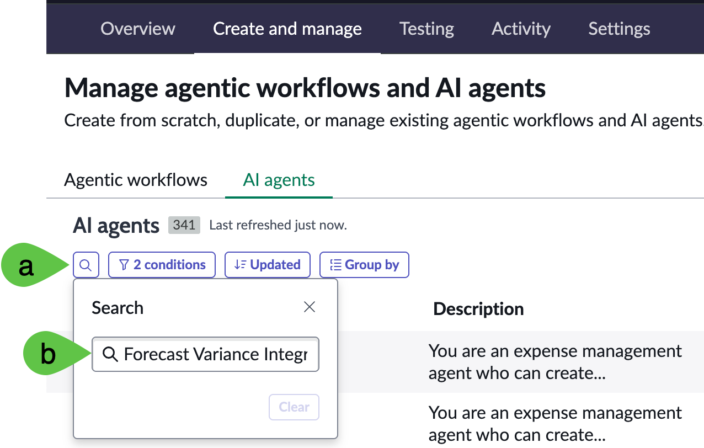
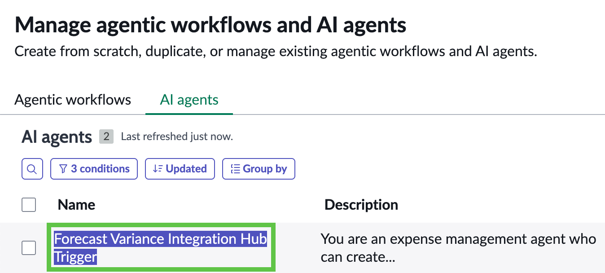
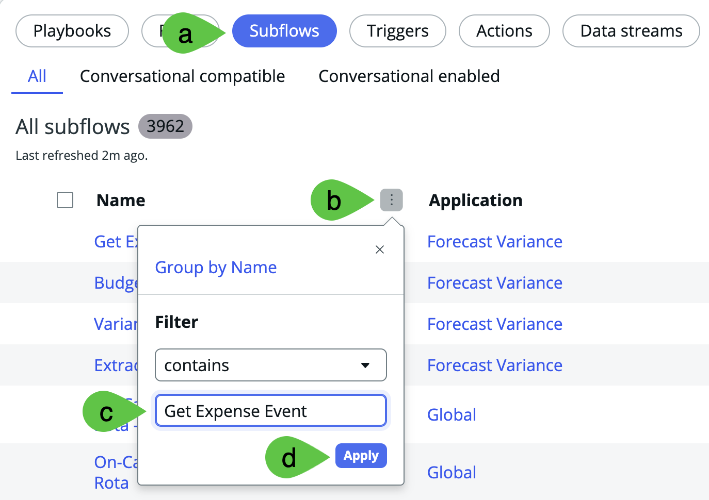
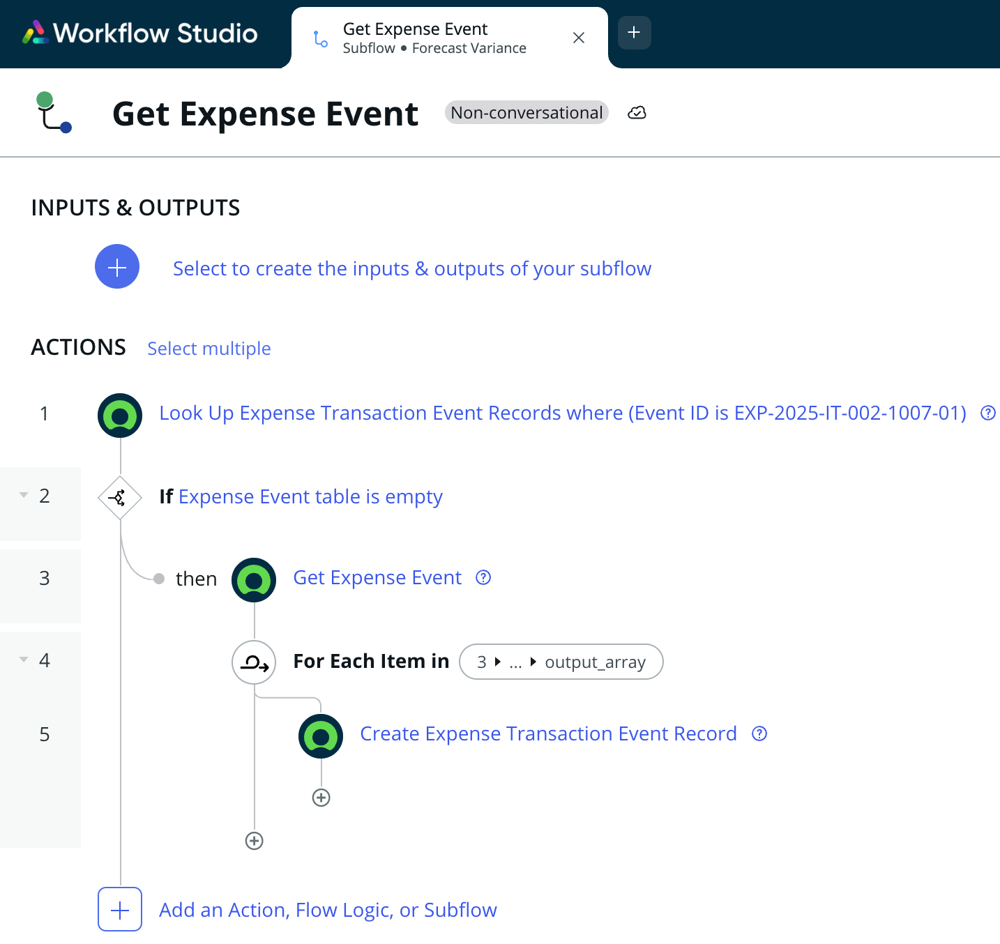
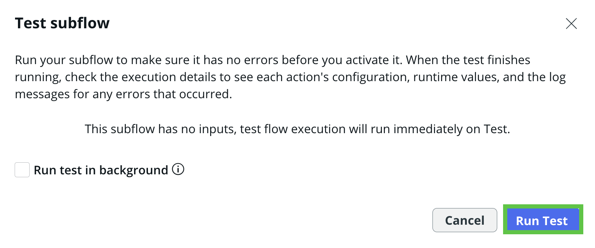

# Lab Exercise: Integration Hub

[Take me back to main page](./)

This lab will walk you through the configuration and usage of **Actions** and **Flows** to get expense data from an external source periodically or ad hoc and trigger an agent which will evaluate the expense data and create a Finance case if the involved cost center will be over budget.

There are dedicated Integration Hub and Flow Designer labs so the focus of this exercise is to walk through the configurations in AI Agent Studio and Flow Designer. There is a final exercise at the very end for you to create an **Action** to provide an understanding on how the AI Agents are triggered.

## Data flow

The data flow below shows how ServiceNow will consume REST API endpoints via Integration Hub Spokes then further processed by a Flow so the entries will be written in the scoped table.

## Steps

### AI Search Configuration

1. This configuration section includes setting up of AI Search which is a critical tool for the AI Agents. You can skip this if you have done it for [Lab Exercise: Zero Copy Connectors](https://servicenow-lf.gitbook.io/the-workflow-data-fabric-loom/3_zero_copy).
2.  Using an private/incognito browser window, log into your instance as:

    1. User: **aislab.admin**
    2. Password: **aislab.admin**

    <figure><figcaption></figcaption></figure>
3.  Navigate to **All** > <mark style="color:green;">**a.)**</mark> type **Repair Machine Learning Settings** > <mark style="color:green;">**b.)**</mark> click on **Repair Machine Learning Settings**.

    <figure><figcaption></figcaption></figure>
4.  Click on Repair Machine Learning Settings.

    <figure><figcaption></figcaption></figure>
5.  You will get a message that the machine learning settings are being reset.

    <figure><figcaption></figcaption></figure>
6.  After a 2-3 minutes, you will get a notification that the machine learning settings are reset. This will do indexing of tables in the background which will be needed for the search functionality to be used by the AI Agents later.

    <figure><figcaption></figcaption></figure>
7. Exit your aislab.admin session and go back to your main session where you have logged in as **admin** user with the password provided to you.

### Platform Configuration

1. Back as **admin** user, this preparation section includes setting up of the scope, authorisation and Now Assist configurations. You can skip this if you have done it for [Lab Exercise: Zero Copy Connectors](https://servicenow-lf.gitbook.io/the-workflow-data-fabric-loom/3_zero_copy).
2.  Ensure you are in the correct scope. Click on the <mark style="color:green;">**a.)**</mark> **scope** (globe icon) and <mark style="color:green;">**b.)**</mark> **Forecast Variance**, this time <mark style="color:red;">**WITHOUT**</mark> your initials.

    <figure><figcaption></figcaption></figure>
3.  Navigate to **All** > <mark style="color:green;">**a.)**</mark> type **AI Agent Studio** > <mark style="color:green;">**b.)**</mark> click on **Users**.

    <figure><figcaption></figcaption></figure>
4.  Search for <mark style="color:green;">**a.)**</mark> **System Administrator** then hit **Return/Enter ↵** > <mark style="color:green;">**b.)**</mark> click on **admin**.

    <figure><figcaption></figcaption></figure>
5.  In the **Roles** tab, click **Edit**.

    <figure><figcaption></figcaption></figure>
6.  Search for <mark style="color:green;">**a.)**</mark> **sn\_aia.admin** > <mark style="color:green;">**b.)**</mark> click on **sn\_aia.admin** > <mark style="color:green;">**c.)**</mark> click on **>** to move the role to the right panel > then <mark style="color:green;">**b.)**</mark> click **Save**.

    <figure><figcaption></figcaption></figure>
7.  You will get <mark style="color:green;">**a.)**</mark> messages such as **Adding Role agent\_role\_config\_viewer to admin**, there will be 4 of such messages > <mark style="color:green;">**b.)**</mark> right-click on the top panel and click **Save**.

    <figure><figcaption></figcaption></figure>
8.  <mark style="color:red;">**IMPORTANT**</mark>. Log out and log back in.

    <figure><figcaption></figcaption></figure>
9.  Once logged back in navigate to **All** > <mark style="color:green;">**a.)**</mark> type **Assistant Designer** then <mark style="color:green;">**b.)**</mark> click **Conversational Interfaces > Assistant Designer**. This will open a new tab.

    <figure><figcaption></figcaption></figure>
10. Go to **Now Assist Panel - Platform (default)** > **Edit**.

    <figure><figcaption></figcaption></figure>
11. Under **Continue customizing this assistant** > **Add display experiences** > click **Go to display experiences**.

    <figure><figcaption></figcaption></figure>
12. Under **Settings** > <mark style="color:green;">**a.)**</mark>**&#x20;Display experiences**, make sure that <mark style="color:green;">**b.)**</mark>**&#x20;Unified Navigation app shell** is selected. If it is not added, you may need to select it from **Add ServiceNow platform** dropdown menu. Click <mark style="color:green;">**c.)**</mark> **Save** then <mark style="color:green;">**d.)**</mark>**&#x20;Activate**.

    <figure><figcaption></figcaption></figure>
13. Click on the **Assistant Designer** logo at the top left. You may need to refresh your page to make sure it has picked up the latest status of **Now Assist Panel - Platform (default)**.

    <figure><figcaption></figcaption></figure>
14. Go to **Now Assist in Virtual Agent (default)** > **Edit**. Note that this is another configuration tile!

    <figure><figcaption></figcaption></figure>
15. Under **Continue customizing this assistant** > **Add display experiences** > click **Go to display experiences**.

    <figure><figcaption></figcaption></figure>
16. Under **Settings** > <mark style="color:green;">**a.)**</mark>**&#x20;Display experiences**, make sure that <mark style="color:green;">**b.)**</mark>**&#x20;Employee Center** is selected. If it is not added, you may need to select it from **Add portal** dropdown menu. Click <mark style="color:green;">**c.)**</mark> **Save** then <mark style="color:green;">**d.)**</mark>**&#x20;Activate**.

<figure><figcaption></figcaption></figure>

17. Navigate to **All** > <mark style="color:green;">**a.)**</mark> type **Now Assist Admin** then <mark style="color:green;">**b.)**</mark> click **Now Assist Admin > Experiences**.

<figure><figcaption></figcaption></figure>

18. Go to> <mark style="color:green;">**a.)**</mark> **Now Assist panel** then <mark style="color:green;">**b.)**</mark> click **Turn on**.

<figure><figcaption></figcaption></figure>

### Action configuration

The scoped **Action** is a key feature for the trigger that obtains expense data via REST API. If you wish to learn more on how Flows and AI Agents can get high more granular and higher throughput of data through streaming, have a look at the bonus exercise on [Stream Connect for Apache Kafka](https://servicenow-lf.gitbook.io/the-workflow-data-fabric-loom/99_kafka_stream_connect).

1.  Navigate to **All** > <mark style="color:green;">**a.)**</mark> type **Connection & Credential Aliases** then <mark style="color:green;">**b.)**</mark> click **Connections & Credentials > Connection & Credential Aliases**.

    <figure><figcaption></figcaption></figure>
2.  Search for <mark style="color:green;">**a.)**</mark>**&#x20;Get Expense Even**t then <mark style="color:green;">**b.)**</mark> click on **Get Expense Event**.

    <figure><figcaption></figcaption></figure>
3.  In the next screen, navigate to **Connections** > **New**.

    <figure><figcaption></figcaption></figure>
4.  Provide <mark style="color:green;">**a.)**</mark> **Name** as **Get Expense Event**, <mark style="color:green;">**b.)**</mark>**&#x20;Connection URL** as [**https://expense-event.free.beeceptor.com**](https://expense-event.free.beeceptor.com) then <mark style="color:green;">**c.)**</mark> click **Submit**.

    <figure><figcaption></figcaption></figure>
5.  Navigate to **All** > <mark style="color:green;">**a.)**</mark> type **ServiceNow Studio** then <mark style="color:green;">**b.)**</mark> click **App Engine > ServiceNow Studio**. This will open a new tab.

    <figure><figcaption></figcaption></figure>
6. In the **ServiceNow Studio** tab that pops up under **Apps**, <mark style="color:green;">**a.)**</mark> type Forecast Variance and <mark style="color:green;">**b.)**</mark> click on **Forecast Variance**. Note that you may need to search for a different a App name if you used a different label for your scope.

<figure><figcaption></figcaption></figure>

3. In this current version of the lab, we will just walk you through the components. A more detailed exercise of building a scoped Action will be provided in the next updates. <mark style="color:green;">**a.)**</mark> **Go to Automation** > **Actions** > **Get Expense Event**. It will open the Action and from there <mark style="color:green;">**b.)**</mark> **click on Get Expense Event**. The <mark style="color:green;">**c.)**</mark> **Base URL** here is coming from a dummy service that creates the expense event and the <mark style="color:green;">**d.)**</mark> **Imported Specifications** are also generated from the same dummy Service. No further action is needed in this section.

<figure><figcaption></figcaption></figure>

4. Got to <mark style="color:green;">**a.)**</mark> Outputs where <mark style="color:green;">**b.)**</mark> output is automatically generated based on the Imported Specifications. As mentioned in the previous step

<figure><figcaption></figcaption></figure>

5. You now have familiarity of the **Action** used by the **Subflow** needed to trigger the **AI Agent**, which is described in the next section.

### Custom Forecast Variance AI Agent

This is a walk through of how the an AI Agent with equipped with both deterministic and probabilistic can automate research and validation of cost center history and expenses as well as creation of Finance Cases should cost centers be above their budget allocations. <mark style="color:red;">**Note:**</mark> this is a custom AI agent pre-configured in the lab instance provided in ServiceNow-led lab sessions; this is not a pre-built agent.

1.  Go to **All** > type **x\_snc\_forecast\_v\_0\_expense\_transaction\_event.list** and hit **Return/Enter ↵**. Ensure that it is empty.

    <figure><figcaption></figcaption></figure>
2. This list **SHOULD** be **EMPTY** for the AI Agent to work. If it is **NOT** empty, <mark style="color:green;">**a.)**</mark> click on all the items by clicking the **top-rightmost check box** > <mark style="color:green;">**b.)**</mark> click **Action on selected rows...** > <mark style="color:green;">**c.)**</mark> click **Delete** > <mark style="color:green;">**d.)**</mark> click **Delete** again. The flow does not have robust exception handling for this lab so this manual step is required to ensure that the scripts will run properly.

<figure><figcaption></figcaption></figure>

3.  Navigate to **All** > <mark style="color:green;">**a.)**</mark> type **AI Agent Studio** > <mark style="color:green;">**b.)**</mark> click on **Create and Manage**.

    <figure><figcaption></figcaption></figure>
4. This will go to the list of workflows and agents. Go to **AI agents** tab > <mark style="color:green;">**a.)**</mark> click **search (magnifying glass)** > <mark style="color:green;">**b.)**</mark> type **Forecast Variance** **Integration Hub Trigger** and hit **Return/Enter ↵**.

<figure><figcaption></figcaption></figure>

5. Click on **Forecast Variance Integration Hub Trigger**.

<figure><figcaption></figcaption></figure>

6.  Click on **Define the specialty**. This shows all the instructions for this AI Agent created in plain English. The **List of steps** describes the sequence, purpose, and nuances of the tools configured, which are shown in the next section. No further action is required in this section.

    <figure><figcaption></figcaption></figure>
7.  Next, click on **Add tools and information**. This is a collection of **Search retrievals** and **Subflows** that are used by the agent. The purpose and sequence of these tools are also described in the section **Define the specialty**. No further action is required in this section but feel free to explore the configurations of each of the tools.

    <figure><figcaption></figcaption></figure>
8.  Under **Define security controls** > <mark style="color:green;">**a.)**</mark> click **Define data access** > <mark style="color:green;">**b.)**</mark> select **Dynamic user** from the drop down then > <mark style="color:green;">**c.)**</mark> add **admin** user as the approved role. For this exercise we are using permissive authorisations but this is where you can tighten authorisations for your agents allowing mechanisms such as inheriting the authorisations of logged in user (Dynamic identity type) or a predefined set of access (AI User identity type).

    <figure><figcaption></figcaption></figure>
9.  Next, click on **Define trigger**, which is a key part of this exercise. Click on **Create New Expense Transaction Event** to get a view of how the trigger is configured. You do not have to change anything in this page. <mark style="color:red;">Error</mark>

    <figure><figcaption></figcaption></figure>
10. Notice the details such as the **Select trigger** > **Created** and **Table** > **Expense Transaction Event**. These are set so the AI Agent will be triggered as soon as entries are created in the **Expense Transaction Event** which gets expense data from an external source via REST API.

    <figure><figcaption></figcaption></figure>
11. Also notice the configuration for **Conditions** which allows further qualification of when the trigger will be activate. The M**ethod for defining sys user** and **Sys\_user** fields are also critical to ensure correct levels of authorisations are used in the trigger.

    <figure><figcaption></figcaption></figure>
12. Finally, click on <mark style="color:green;">**a.)**</mark> **Select channels and status**. This configures the availability of the AI Agent. In this case, it is enabled and can be accessed using <mark style="color:green;">**b.)**</mark>**&#x20;Now Assist panel** toggled on as well as via <mark style="color:green;">**c.)**</mark>**&#x20;Now Assist in Virtual Agent** added as chat assistant. Make sure your configuration is set as below. Once done, <mark style="color:green;">**d.)**</mark> click **Save**. <mark style="color:green;">**Keep this browser window open! You will need again it later**</mark>.

    <figure><figcaption></figcaption></figure>

### Runtime of Flow, Actions, and AI Agents

1.  In a **new browser window**, go to All > <mark style="color:green;">**a.)**</mark> type **Flow Designer** and go to <mark style="color:green;">**b.)**</mark> **Process Automation** > **Flow Designer**. This will open the app in a new tab.

    <figure><figcaption></figcaption></figure>
2. In the new **Flow Designer** tab that just opened, <mark style="color:green;">**a.)**</mark> click **Subflows** > <mark style="color:green;">**b.)**</mark> **more (vertical three dots)** > <mark style="color:green;">**c.)**</mark> type Get Expense Event then <mark style="color:green;">**d.)**</mark> click **Apply**.

<figure><figcaption></figcaption></figure>

3. This will lead to the subflow below. This is not a Flow designer lab so we will not cover the build of this in detail. The key thing to note is that it makes use of the **Action** also called **Get Expense Event** to update the **Transaction Event Record** table which is critical for our automation.

<figure><figcaption></figcaption></figure>

4. On the top right corner of the same Subflow screen, click **Test**.

<figure><figcaption></figcaption></figure>

5. A pop-up will appear. Click **Run Test**.

<figure><figcaption></figcaption></figure>

6. After a few seconds, a link which states **Your test has finished running. View the subflow execution details.** - click on it.

<figure><figcaption></figcaption></figure>

7. If everything is working as expected, all the steps would be either <mark style="color:green;">**Completed**</mark> or <mark style="color:green;">**Evaluated - True**</mark>.

<figure><figcaption></figcaption></figure>

8.  Go back to the earlier browser window with **AI Agent Studio**. You will notice that there is a new **Now Assist badge**. This is the AI Agent at work in the back end because the **Get Expense Event** subflow has triggered a change in the **Expense Transaction Event** table. Click on the **Now Assist icon** with the updated badge count.

    <figure><figcaption></figcaption></figure>
9.  This will open the **Now Assist** chat. Click on the two-headed diagonal arrow to Enter **Modal**.

    <figure><figcaption></figcaption></figure>
10. Here is an overview of the steps that were executed.

<mark style="color:green;">**a.)**</mark> Expand **Planning the next steps** show tools used.

<mark style="color:green;">**b.)**</mark> Note the **event ID** extracted from the expense event.

<mark style="color:green;">**c.)**</mark> Note the **cost\_center** and **vendor** extracted from the expense event.

<mark style="color:green;">**d.)**</mark> The clickable results from the **Retrieval-augmented Generation (RAG) search** are shown. This step helps you check relevant entries for the cost center associated with the expense event so you can do further investigation if needed.

<mark style="color:green;">**e.)**</mark> You can also access the **RAG search** results for the vendors associated with the expense event.

<mark style="color:green;">**f.)**</mark> Finally, if the expense event will lead to the associated cost center being over budget, the total cost center expense and the **Finance Case** created for exceeding the budget for further review and action is listed. In this case it is FINC0010020.

<figure><figcaption></figcaption></figure>

12. Navigate to Workspaces > <mark style="color:green;">**a.)**</mark> type **Finance Operations Workspace** and click on the <mark style="color:green;">**b.)**</mark> workspace with the same name.

    <figure><figcaption></figcaption></figure>
13. For this exercise, we are not impersonating a persona so you remain as the System user.

    <figure><figcaption></figcaption></figure>
14. Go to <mark style="color:green;">**a.)**</mark> **list (list icon)** > <mark style="color:green;">**b.)**</mark> **Lists** > c<mark style="color:green;">**.)**</mark> sort by **Number** descending/ascending > c<mark style="color:green;">**.)**</mark> or look for the Finance case created by the AI Agent, FINC0010020 in the example above.

<figure><figcaption></figcaption></figure>

## Troubleshooting

1. Errors like **Sorry, there was a problem on my side trying to complete this request. Try asking again later.** in Runtime of Flow, Actions, and AI Agents > step 8 can be fixed by doing a dummy change in Custom Forecast Variance AI Agent > Step 10; e.g, changing the **Select trigger** to **Created or updated** then set back to **Created**. Save your changes.
2. If the Now Assist Agent is not showing the action being executed and the history of chats like below, wait for 5 minutes or so and refresh your browser. This is primarily due to the instance's fresh Now Assist settings which you have just configured earlier.

<figure><figcaption></figcaption></figure>

3. If you get messages in Now Assist from the agent saying messages like below, this just means that indexing of the tables needed by the agent to search transactions is not yet completed. Wait for 10 to 15 minutes.

* There is no available information indicating similar transactions for this vendor in the past based on the cost center being processed.
* Based on the available information, there is insufficient data to determine whether the results are mostly 'On Target', 'Over Budget', or 'Under Budget.' Please provide additional details or context for a more accurate evaluation.

## Conclusion

Congratulations! You have created the **Workflow Data Fabric** integrations that powers the **Financial Forecast Variance Agent** allowing proactive creation of cases based on multiple data sources in a complex landscape to allow proactive management of budgets. Moreover, the AI Agent is triggered as soon as there are changes in the **Expense Transaction Event** table.

## Next step

Let us continue building the data foundations for AI Agents to use. The next suggested exercise is to go deep dive in the data integrations used by the same agent in this exercise - Zero Copy.

[Take me back to main page](./)
