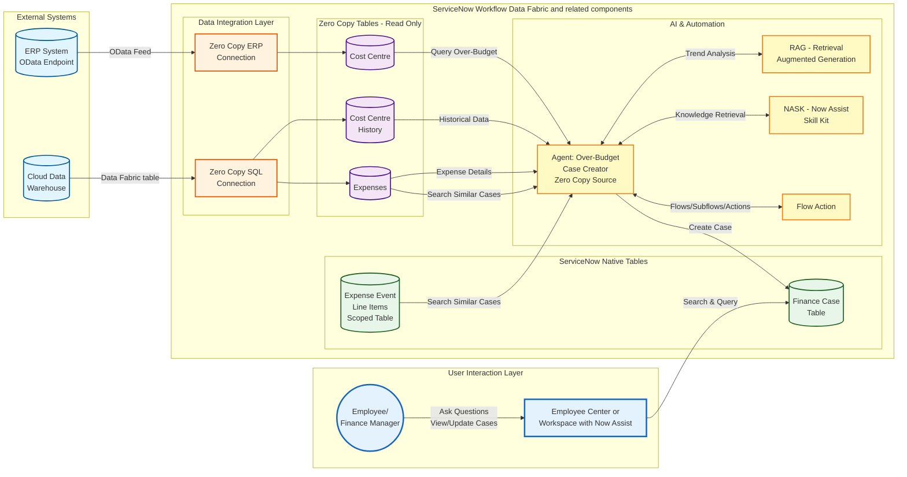

# Lab Exercise: Zero Copy Connectors

[Take me back to main page](./)

This lab will walk you through integration of data coming from Cloud Data Warehouses and ERP using Zero Copy Connectors (ZCC) for SQL and ERP respectively.

## Data flow

The data flow below shows how ServiceNow consumes data from the local Expense Transaction Event table populated by REST API events. The events processed can be near-real-time or historical (e.g. transaction events after over a period of time). Aside from local tables, ServiceNow will also consume external data from a Cloud Data Warehouse and an ERP system via ZCC for SQL and ERP respectively. The data taken from the external sources will be used by an agent which will also create Finance Cases for Cost Centers which are going over budget. While majority of the workflow is handled deterministically, AI Agents will provide additional context by searching and comparing expenses and cost center histories to enrich the workflow data that will be used by the personnel in charge of the cost centers.

**Note**: future versions of this lab will include ServiceNow Enterprise Graph which will provide a universal query functionality that brings together the various internal and external data sources. As of Jan-2026, said feature is not globally available and is hence not yet included in this lab.

## Steps

### AI Search Configuration

1. This configuration section includes setting up of AI Search which is a critical tool for the AI Agents.  You can skip this if you have done it for [Lab Exercise: Integration Hub](https://servicenow-lf.gitbook.io/the-workflow-data-fabric-loom/2_integration_hub).&#x20;
2.  Using an private/incognito browser window, log into your instance as:

    1. User: **aislab.admin**
    2. Password: **aislab.admin**

     (1).png>)
3.  Navigate to **All** > <mark style="color:green;">**a.)**</mark> type **Repair Machine Learning Settings** > <mark style="color:green;">**b.)**</mark> click on **Repair Machine Learning Settings**.

     (1) (1).png>)
4.  Click on Repair Machine Learning Settings.

     (1).png>)

5.  You will get a message that the machine learning settings are being reset.&#x20;

     (1).png>)
6.  After a 2-3 minutes, you will get a notification that the machine learning settings are reset. This will do indexing of tables in the background which will be needed for the search functionality to be used by the AI Agents later.

     (1).png>)
7. Exit your aislab.admin session and go back to your main session where you have logged in as **admin** user with the password provided to you.

### Platform Configuration

1. Back as **admin** user, this preparation section includes setting up of the scope, authorisation and Now Assist configurations. You can skip this if you have done it for [Lab Exercise: Zero Copy Connectors](https://servicenow-lf.gitbook.io/the-workflow-data-fabric-loom/3_zero_copy).&#x20;
2.  Ensure you are in the correct scope. Click on the <mark style="color:green;">**a.)**</mark> **scope** (globe icon) and <mark style="color:green;">**b.)**</mark> **Forecast Variance**, this time <mark style="color:red;">**WITHOUT**</mark> your initials.&#x20;

    
3.  Navigate to **All** > <mark style="color:green;">**a.)**</mark> type **AI Agent Studio** > <mark style="color:green;">**b.)**</mark> click on **Users**.

     (1) (1) (1).png>)
4.  Search for <mark style="color:green;">**a.)**</mark>  **System Administrator** then hit **Return/Enter ↵** > <mark style="color:green;">**b.)**</mark> click on **admin**.&#x20;

     (1).png>)
5.  In the **Roles** tab, click **Edit**.

     (1) (1) (1).png>)

6.  Search for <mark style="color:green;">**a.)**</mark>  **sn\_aia.admin** > <mark style="color:green;">**b.)**</mark> click on **sn\_aia.admin** > <mark style="color:green;">**c.)**</mark> click on **>** to move the role to the right panel > then <mark style="color:green;">**b.)**</mark> click **Save**.&#x20;

     (1) (1) (1).png>)

7.  You will get <mark style="color:green;">**a.)**</mark>  messages such as **Adding Role agent\_role\_config\_viewer to admin**, there will be 4 of such messages > <mark style="color:green;">**b.)**</mark> right-click on the top panel and click **Save**.

     (1) (1) (1).png>)

8.  <mark style="color:red;">**IMPORTANT**</mark>. Log out and log back in.

     (1) (1).png>)
9.  Once logged back in navigate to **All** > <mark style="color:green;">**a.)**</mark> type **Assistant Designer** then <mark style="color:green;">**b.)**</mark> click **Conversational Interfaces > Assistant Designer**. This will open a new tab.

     (1) (1).png>)
10. Go to **Now Assist Panel - Platform (default)** > **Edit**.

     (1) (1).png>)
11. Under **Continue customizing this assistant** > **Add display experiences** > click **Go to display experiences**.

     (1) (1).png>)

12. Under **Settings** > <mark style="color:green;">**a.)**</mark>**&#x20;Display experiences**, make sure that <mark style="color:green;">**b.)**</mark>**&#x20;Unified Navigation app shell** is selected. If it is not added, you may need to select it from **Add ServiceNow platform** dropdown menu. Click <mark style="color:green;">**c.)**</mark> **Save** then <mark style="color:green;">**d.)**</mark>**&#x20;Activate**.

     (1) (1).png>)

13. Click on the **Assistant Designer** logo at the top left. You may need to refresh your page to make sure it has picked up the latest status of **Now Assist Panel - Platform (default)**.

     (1).png>)
14. Go to **Now Assist in Virtual Agent (default)** > **Edit**. Note that this is another configuration tile!&#x20;

     (1).png>)

15. Under **Continue customizing this assistant** > **Add display experiences** > click **Go to display experiences**.

     (1) (1).png>)
16. Under **Settings** > <mark style="color:green;">**a.)**</mark>**&#x20;Display experiences**, make sure that <mark style="color:green;">**b.)**</mark>**&#x20;Employee Center** is selected. If it is not added, you may need to select it from **Add portal** dropdown menu. Click <mark style="color:green;">**c.)**</mark> **Save** then <mark style="color:green;">**d.)**</mark>**&#x20;Activate**.

 (1).png>)

17. Navigate to **All** > <mark style="color:green;">**a.)**</mark> type **Now Assist Admin** then <mark style="color:green;">**b.)**</mark> click **Now Assist Admin > Experiences**.

    .png>)
18. Go to> <mark style="color:green;">**a.)**</mark> **Now Assist panel** then <mark style="color:green;">**b.)**</mark> click **Turn on**.

    .png>)

### Zero Copy for ERP

This provides the steps needed to connect ServiceNow to the ERP system to obtain Cost Center Master data.

1.  Navigate to All > <mark style="color:green;">**a.)**</mark> type **Zero Copy Connector for ERP Home** > <mark style="color:green;">**b.)**</mark> click **Zero Copy Connector for ERP Home**.

    
2.  The **Zero Copy Connector for ERP Home** is a workspace which has the layout as below.

    .png>)
3.  Click on <mark style="color:green;">**a.)**</mark> **Models (database icon)** > <mark style="color:green;">**b.)**</mark> click **Model Name** > **more (vertical three dots)** > <mark style="color:green;">**c.)**</mark> type **DP: Cost Center** > <mark style="color:green;">**d.)**</mark> click **Apply**.

    .png>)
4.  Click on **DP: Cost Center**.

    .png>)
5.  Note the <mark style="color:green;">**a.)**</mark> popup that indicates that you are opening an **ERP Data Product** which is delivered as templates that customers can use to ramp-up creation of ERP models. Click <mark style="color:green;">**b.)**</mark> **Clone** to create a copy of this model.

    .png>)
6.  Provide the label for the cloned model as <mark style="color:green;">**a.)**</mark> **SAP Cost Center** and take not of the Target application which should be <mark style="color:green;">**b.)**</mark> **Forecast Variance**. Click <mark style="color:green;">**c.)**</mark> Clone this model once done.

    .png>)
7.  After cloning the model, you will be redirected to the **Models** section. Click **SAP Cost Center** which you have just created as a clone in the previous step. Click **Manage model**.

    .png>)
8.  Click **Read**.

    .png>)
9.  Notice that there is a BAPI already configured based on the **DP: Cost Center** model you have cloned earlier. The entity **BAPI\_COSTCENTER\_GETDETAIL1** is already configured here so you do not have to do anything. As mentioned earlier, there are other ways to obtain master data from SAP (whether it is Cost Center, Materials, etc.) such as RFC table reads or OData endpoints.&#x20;

    .png>)
10. Click on **Specify Inputs**. You do not need to do anything in this screen. The intent is to provide an overview of what can be configured as fields for selections when extracting or displaying information from the ERP system. If the table, BAPI, or OData endpoint supports it, this screen can be kept blank which is an equivalent of selecting all entries.

    .png>)
11. Click on **Choose outputs**. You do not need to do anything in this screen. The intent is to provide an overview of what can be configured as the output for your selection or extraction. Both **Specify inputs** and **Choose outputs** sections can be intimidating for non-SAP practitioners which led to the creation of the **Data Product** which we cloned in **Step 5**. Find out more about [**ERP Data Products here**](https://store.servicenow.com/store/app/9a0ad9f41b19e650396216db234bcba9).

    .png>)
12. Go to <mark style="color:green;">**a.)**</mark> **Extraction tables (Sankey diagram icon)** and click <mark style="color:green;">**b.)**</mark> **Name** > **more (vertical three dots)** > <mark style="color:green;">**c.**</mark> type **SAP Cost Center** and <mark style="color:green;">**d.)**</mark> click **Apply**.

    .png>)
13. Click on **SAP Cost Center**.

    .png>)
14. There is a notification stating that <mark style="color:green;">**a.)**</mark> the object is in the **Zero Copy Connector for ERP application**, this is expected. Note that the <mark style="color:green;">**b.)**</mark> ERP model is different from what you have created earlier where it is called **SAP Material Transfer Cost Center**, this is expected. These discrepancies are due to the fact that we are not connected to a live SAP system for this exercise due to various constraints, however all the tools and configurations you have used are representative of integrating with SAP. Finally, <mark style="color:green;">**c.)**</mark> click on the **Target table link** which is **/sn\_erp\_integration\_cost\_center\_list.do**.

    .png>)
15. This will lead you to the extraction table which contains Cost Center Master Data from SAP. This exercise uses an extraction scenario where data from SAP is stored in ServiceNow. Online read is also possible with more details found on the blog post [Zero Copy Connector for ERP guide by Leo Francia in the ServiceNow community](https://www.servicenow.com/community/app-engine-for-erp-blogs/part-1-of-4-intelligent-erp-workflows-get-sap-data-into/ba-p/3192800).

17. Congratulations! You have set-up the integration a Cloud Data Warehouse using Zero Copy Connector for ERP.

### Zero Copy for SQL

This provides the steps needed to connect ServiceNow to the Cloud Data Warehouse and get summary data needed for workflow context and logic.

1. For reference purposes only, the table which will be used as source for Zero Copy for SQL coming from Snowflake is shown below. No action needs to be done for this step.

2.  In the ServiceNow navigation, go to All > <mark style="color:green;">**a.)**</mark> type **Workflow Data Fabric Hub** > <mark style="color:green;">**b.)**</mark> go to **Workflow Data Fabric Hub**.

    .png>)
3.  In the landing page, go to **Established connections** > **Snowflake Connection (S)**. <mark style="color:red;">**Note:**</mark> this established connection is configured specifically for instances used in ServiceNow-led labs.

     (1).png>)
4.  In the **Connection details** tab of the screen that immediately follows, the established connection is configured as shown in the screenshot below. No action needs to be done for this step. You might also get a notification stating **This connection is read-only in the 'Forecast Variance' application scope...** which can be ignored.

     (1).png>)
5.  Go to <mark style="color:green;">**a.)**</mark> Data assets > <mark style="color:green;">**b.)**</mark> beside **u\_lab\_cc\_summary** click **Create data fabric table**.

     (1).png>)
6.  Provide the information needed for <mark style="color:green;">**a.)**</mark> the **Label** e.g. **cc\_summ\_\<your initials>** and the <mark style="color:green;">**b.)**</mark> **Name** which will automatically provided. <mark style="color:red;">**Note:**</mark> keep the name length not more than 35 characters such as what is listed below, e.g. **x\_snc\_forecast\_v\_0\_df\_cc\_summ\_lfr**. Click <mark style="color:green;">**c.)**</mark> **Continue** once done.

     (1).png>)
7.  In the screen that immediate follows, click on the tick box beside **Name** and this will include all the fields from the Snowflake data asset to the data fabric table being configured.

     (1).png>)
8.  Look for **Cost center** column > change the data type from **String** to <mark style="color:green;">**a.)**</mark> **Reference** and click <mark style="color:green;">**b.)**</mark> **Reference** to set the table from which **Cost center** column will refer to.

     (1).png>)
9. In the modal pop-up that appears, select the table **sn\_erp\_integration\_cost\_center** which you have set-up in the ZCC for ERP lab exercise.

10. In the same modal pop-up, select **Cost Center**.

11. Once completed, click **Set Reference**.

12. Finally, set GL account as the **Primary** key as shown in the <mark style="color:green;">**a.)**</mark> toggle below. Click <mark style="color:green;">**b.)**</mark> **Finish** once done.

    .png>)
13. A pop-up dialog indicating that a primary key has been defined. Click **Confirm**.

14. This will lead you to a screen showing the data assets created. In the same screen, click on the <mark style="color:green;">**a.)**</mark> three vertical dots then <mark style="color:green;">**b.)**</mark> **Open list**.

    .png>)
15. This will lead you to the data fabric table.&#x20;

    .png>)
16. Congratulations! You have set-up the integration a Cloud Data Warehouse using Zero Copy Connector for SQL.

### Custom Forecast Variance AI Agent in action

This is a walk through of how the an AI Agent with equipped with both deterministic and probabilistic can automate research and validation of cost center history and expenses as well as creation of Finance Cases should cost centers be above their budget allocations. <mark style="color:red;">**Note:**</mark> this is a custom AI agent pre-configured in the lab instance provided in ServiceNow-led lab sessions; this is not a pre-built agent.

1. Go to All > type **x\_snc\_forecast\_v\_0\_expense\_transaction\_event.list** and hit **Return/Enter ↵**.

.png>)

2. This will lead to the screen below. Note that this is the table created in [Lab Exercise: Fundamentals](1_Fundamentals.md) and populated with the data from [Lab Exercise: Integration Hub](2_Integration_Hub.md).

3.  After reviewing the table, navigate to All > <mark style="color:green;">**a.)**</mark> type **AI Agent Studio** > <mark style="color:green;">**b.)**</mark> click on **Create and Manage**.

    .png>)
4. This will go to the list of workflows and agents. Go to **AI agents** tab > <mark style="color:green;">**a.)**</mark> click **search (magnifying glass)** > <mark style="color:green;">**b.)**</mark> type **Forecast Variance** and hit **Return/Enter ↵**.

5. You might get multiple results so only get the one which says **Forecast Variance** only.&#x20;

6.  Click on **Define the specialty**. This shows all the instructions for this AI Agent created in plain English. The **List of steps** describes the sequence, purpose, and nuances of the tools configured, which are shown in the next section. No further action is required in this section.

    .png>)
7.  Next, click on **Add tools and information**. This is a collection of **Search retrievals** and **Subflows** that are used by the agent. The purpose and sequence of these tools are also described in the section **Define the specialty**. No further action is required in this section but feel free to explore the configurations of each of the tools.

    .png>)
8.  Under **Define security controls** > <mark style="color:green;">**a.)**</mark> click **Define data access** > <mark style="color:green;">**b.)**</mark> select **Dynamic user** from the drop down then > <mark style="color:green;">**c.)**</mark> add **admin** user as the approved role. For this exercise we are using permissive authorisations but this is where you can tighten authorisations for your agents allowing mechanisms such as inheriting the authorisations of logged in user (Dynamic identity type) or a predefined set of access (AI User identity type).

    .png>)
9. Next, click on **Define trigger**, which is kept blank. You can add the triggers for the AI Agent here but for the exercise, the AI Agent will be triggered manually to be able to show the detail chat responses and debugging. No further action is required in this section.

10. Finally, click on <mark style="color:green;">**a.)**</mark> **Select channels and status**. This configures the availability of the AI Agent. In this case, it is enabled and can be accessed using <mark style="color:green;">**b.)**</mark>**&#x20;Now Assist panel** toggled on as well as via <mark style="color:green;">**c.)**</mark>**&#x20;Now Assist in Virtual Agent** added as chat assistant. Click <mark style="color:green;">**d.)**</mark>**&#x20;Save and test**.

    .png>)
11. You will be directed to the Test AI reasoning tab. To proceed with testing, <mark style="color:green;">**a.)**</mark> type **Help me process EXP-2025-IT-002-1007-01** and <mark style="color:green;">**b.)**</mark> click **Continue to Test Chat Response**.

    .png>)
12. Wait for the test to complete which is indicated by an <mark style="color:green;">**End**</mark> with a check mark. Once that is completed, you can explore the following sections. These automations help assess and review cost centers which are exceeding budget proactively instead of waiting at the end of reporting cycles.

<mark style="color:green;">**a.)**</mark> Expand **Planning the next steps** to see the tools used.

<mark style="color:green;">**b.)**</mark> Note the **cost\_center** and **vendor** extracted from the expense event.

<mark style="color:green;">**c.)**</mark> You can access the result of the **Retrieval-augmented Generation (RAG) search** and click on the links if you wish. This step helps you check relevant entries for the cost center associated with the expense event so you can do further investigation if needed.

<mark style="color:green;">**d.)**</mark> You can also access the **RAG search** results for the vendors associated with the expense event.

<mark style="color:green;">**e.)**</mark> Finally, if the expense event will lead to the associated cost center being over budget, the total cost center expense and the **Finance Case** created for exceeding the budget for further review and action is listed. In this case it is FINC0010003.

.png>)

13. The right panel of the same screen shows the **AI agent decision logs** for debugging purposes.

    .png>)
14. Navigate to Workspaces > <mark style="color:green;">**a.)**</mark> type **Finance Operations Workspace** and click on the <mark style="color:green;">**b.)**</mark> workspace with the same name.

    .png>)
15. For this exercise, we are not impersonating a persona so you remain as the System user.

    .png>)
16. Go to <mark style="color:green;">**a.)**</mark> **list (list icon)** > <mark style="color:green;">**b.)**</mark> **Lists** > c<mark style="color:green;">**.)**</mark> sort by **Number** descending/ascending > c<mark style="color:green;">**.)**</mark> or look for the Finance case  created by the AI Agent, FINC0010003 in the example above.

    .png>)

## Conclusion

Congratulations! You have created the **Workflow Data Fabric** integrations that powers the **Financial Forecast Variance Agent** allowing proactive creation of cases based on multiple data sources in a complex landscape to allow proactive management of budgets.&#x20;

## Next step

Let us continue building the data foundations for AI Agents to use. The next suggested exercise is the creation of the External Content Connector to SharePoint.&#x20;

[Take me back to main page](./)
