# Lab Exercise: External Content Connector

[Take me back to main page](../)

<mark style="color:$warning;">**Note:**</mark> This is a controlled lab and is only accessible in ServiceNow internal demo instances. Please bear with us as we translate this into a widely available lab exercise.

This lab will walk you through the configuration and usage of External Content Connectors as a source of unstructured document data to supplement automations needed in Finance case creation.

## Data flow

The data flow below shows how ServiceNow will get information from indexed documents from a document repository such as SharePoint to provide additional context and information to assist with Flows and Automations.

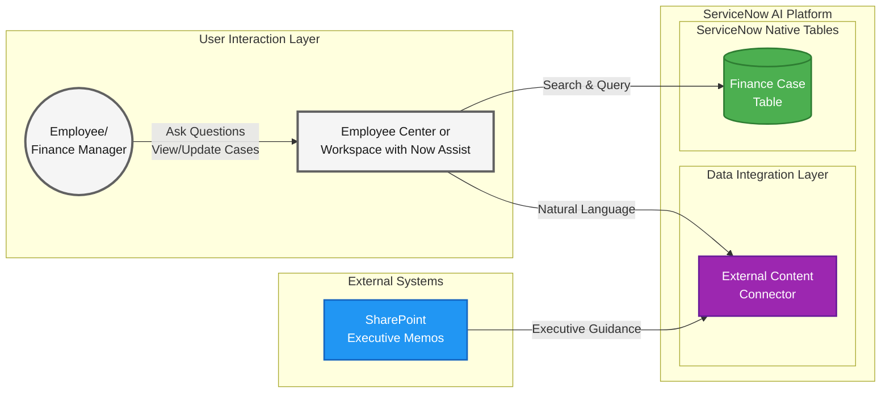

> **Color Legend:** 🟢 Platform | 🟣 Workflow Data Fabric | 🔵 External Systems | ⚪ User Interaction

## Steps

### Preparation steps

1.  Navigate to **All** > <mark style="color:green;">**a.)**</mark> type **Users and Groups** > <mark style="color:green;">**b.)**</mark> click on **Users and Groups > Users**.

    <figure><figcaption></figcaption></figure>
2.  Search for <mark style="color:green;">**a.)**</mark> **System Administrator** then hit **Return/Enter ↵** > <mark style="color:green;">**b.)**</mark> click on **admin**.

    <figure><figcaption></figcaption></figure>
3.  Set the <mark style="color:green;">**a.)**</mark> **Email** to **demouser@wdfdemo.onmicrosoft.com**, <mark style="color:green;">**b.)**</mark> click **Save**. Then <mark style="color:green;">**c.)**</mark> click **Roles** then <mark style="color:green;">**d.)**</mark> click **Edit**.

    <figure>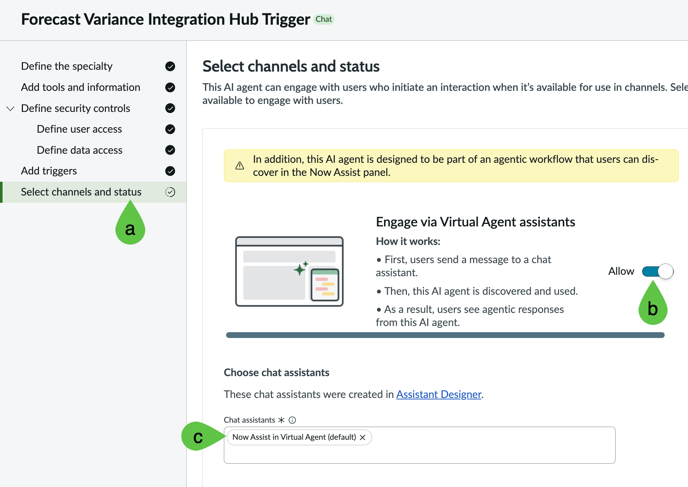<figcaption></figcaption></figure>
4.  Search for <mark style="color:green;">**a.)**</mark> **ais\_high\_security\_admin** > <mark style="color:green;">**b.)**</mark> click on **ais\_high\_security\_admin** > <mark style="color:green;">**c.)**</mark> click on **>** to move the role to the right panel > then <mark style="color:green;">**c.)**</mark> click **Save**.&#x20;

    <figure><figcaption></figcaption></figure>
5.  Right-click on the top panel and click **Save**.

    <figure><figcaption></figcaption></figure>
6.  <mark style="color:red;">**IMPORTANT**</mark>. Log out and log back in. Click on&#x20;

    <figure><figcaption></figcaption></figure>

### Crawl and Usage of External Content Connectors

This provides the steps to execute a crawl of documents to file repositories XCC (External Content Connectors) are set up for. This also provides the steps in a real life scenario on how XCC can help end users with their daily tasks.

This does not include steps in setting up XCC to connect to a SharePoint account as that requires SharePoint administrator rights which are not widely available to various personas.

1.  For this step, change the scope to Global by navigating to the <mark style="color:green;">**a.)**</mark> **globe icon** and clicking <mark style="color:green;">**b.)**</mark> **Global** application scope.

    <figure>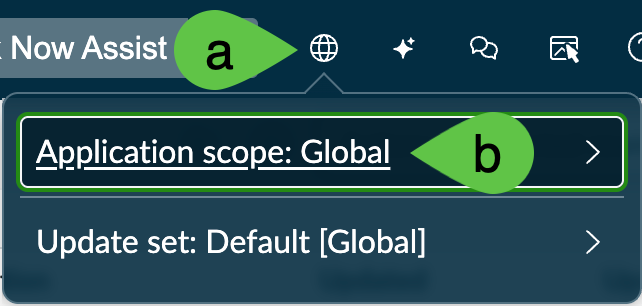<figcaption></figcaption></figure>
2.  Elevate your role. Click on&#x20;

    <figure><figcaption></figcaption></figure>
3.  Choose the role to elevate.

    <figure><figcaption></figcaption></figure>
4. Navigate to All > <mark style="color:green;">**a.)**</mark> type **External Content Connectors** > <mark style="color:green;">**b.)**</mark> click on **External Content Admin Home**.

<figure><figcaption></figcaption></figure>

2.  This will lead you the XCC home screen. Click on **Create** to create a new connection.

    <figure><figcaption></figcaption></figure>
3.  You will be asked to select a source. Depending on your instance image, you may have multiple options. For this exercise, you only need **SharePoint**. <mark style="color:green;">**a.)**</mark> Select it and <mark style="color:green;">**b.)**</mark> click **Next**.

    <figure><figcaption></figcaption></figure>
4. Input the following details in the next screen. As some of r

<mark style="color:green;">**a.)**</mark> **Connector Name: SharePoint Online \<YOUR INITIALS>**

<mark style="color:green;">**b.)**</mark> **Application (client) ID: 26ec3997-e7da-4a95-91dd-d19f8c66b849**

<mark style="color:green;">**c.)**</mark> **Directory (tenant) ID: 53136633-b712-40ba-8c0b-0747745c05be**

<mark style="color:green;">**d.)**</mark> **JKS Certificate:** [obtain here](https://servicenow.sharepoint.com/:u:/s/iaapj/IQC6aY0kjVdSQYrYR8JkpYi3AUVOyZAxfP3GsT6W96xpWII?e=Ee7nZt) and upload, <mark style="color:$warning;">**ServiceNow internal login required**</mark>

<mark style="color:green;">**e.)**</mark> **JKS certificate password:** [obtain here](https://servicenow.sharepoint.com/:x:/s/iaapj/IQA9-mRIzGQYSaI0ab6a--VYAQv5ZKgUGg0RVyiTdEDezq4?e=1gXVAa) <mark style="color:$warning;">**ServiceNow internal login required**</mark>

<mark style="color:green;">**f.)**</mark> **JKS certificate thumbprint:** [obtain here](https://servicenow.sharepoint.com/:x:/s/iaapj/IQA9-mRIzGQYSaI0ab6a--VYAQv5ZKgUGg0RVyiTdEDezq4?e=1gXVAa), <mark style="color:$warning;">**ServiceNow internal login required**</mark>

<figure><figcaption></figcaption></figure>

5. Click Next.

<figure><figcaption></figcaption></figure>

5. Click Next.

<figure><figcaption></figcaption></figure>

6.  Click Next.&#x20;

    <figure><figcaption></figcaption></figure>
7.  Click Next. <mark style="color:red;">**\[Update to include user permission crawl]**</mark>

    <figure><figcaption></figcaption></figure>
8.  Proceed.

    <figure><figcaption></figcaption></figure>
9.  Save.

    <figure><figcaption></figcaption></figure>
10. Completed.

    <figure><figcaption></figcaption></figure>
11. Click on <mark style="color:green;">**a.)**</mark> **User profile** on top right corner (e.g., SA) > <mark style="color:green;">**b.)**</mark>**&#x20;Impersonate user**.

<figure>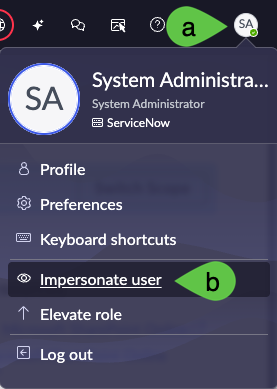<figcaption></figcaption></figure>

9. In the pop-up that appears > <mark style="color:green;">**a.)**</mark> type the name of the XCC-mapped user **Chi Fen** > <mark style="color:green;">**b.)**</mark> click on **Chi Fen** in the drop down <mark style="color:green;">**c.)**</mark> then finally click on **Chi Fen** again to complete impersonation.

<figure>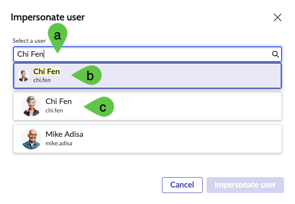<figcaption></figcaption></figure>

10. You will get an indication that the impersonation is successful if you see a red line on the top panel and if your user profile has changed and has a red line on the portrait image as well.

<figure><figcaption></figcaption></figure>

11. Navigate to All > <mark style="color:green;">**a.)**</mark> type **Employee Center** > <mark style="color:green;">**b.)**</mark> click on **Employee Center**.

<figure>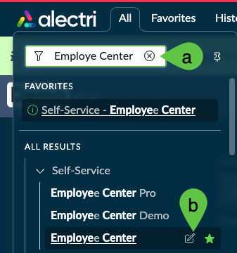<figcaption></figcaption></figure>

12. This will lead to the **Employee Center** home page. Click on **Now Assist** ("sparkle" icon) on the bottom right.

<figure>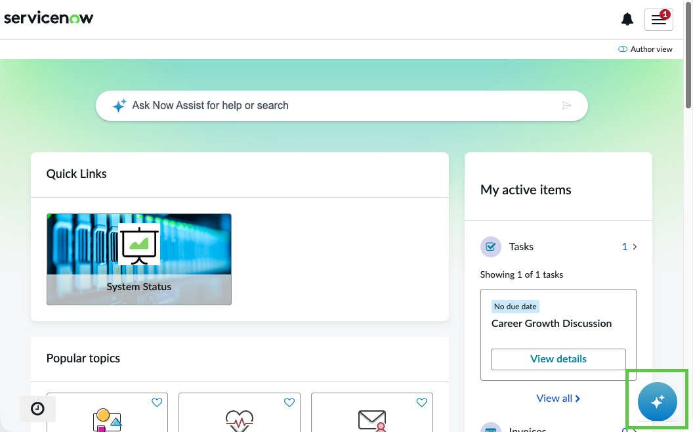<figcaption></figcaption></figure>

13. This will open a open a pop-up for **Now Assist**. Click on **Expand** (two-headed diagonal icon) on the top right so you can have a better typing workspace.

<figure>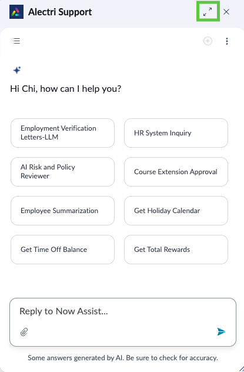<figcaption></figcaption></figure>

14. In the expanded pop-up, type: **Marketing team cost centre in France seems to have gone over-budget. Can you look for any documents that can assist in checking if there are management directives which might have triggered this?** Then hit **Return/Enter ↵**.

<figure>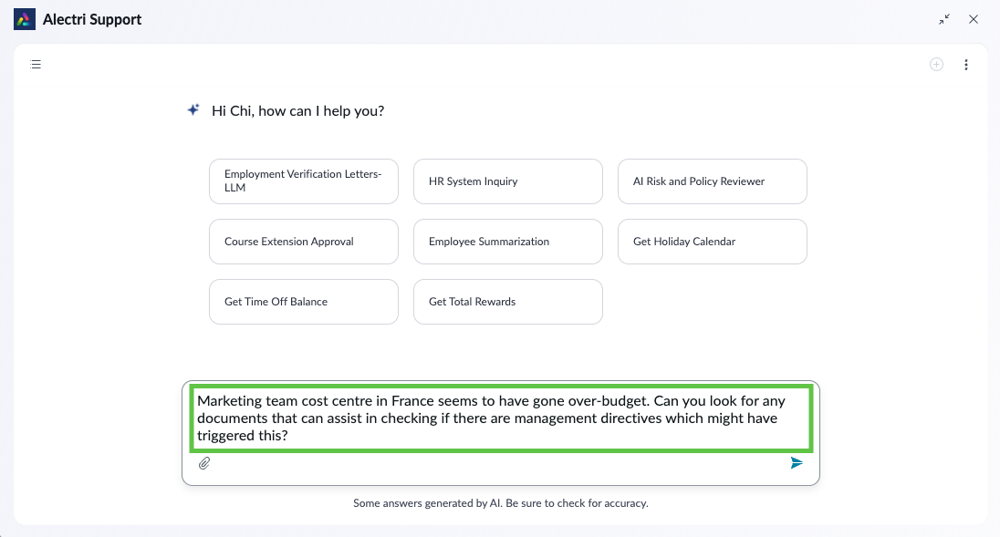<figcaption></figcaption></figure>

15. You will get a <mark style="color:green;">**a.)**</mark> detailed response based on the SharePoint documents that were crawled earlier, which is also aligned with the over-budget entries. Click on the <mark style="color:green;">**b.)**</mark> number **1** then <mark style="color:green;">**c.)**</mark> click on the PDF file **Strategic Memo - European Product Launch.pdf**.

<figure>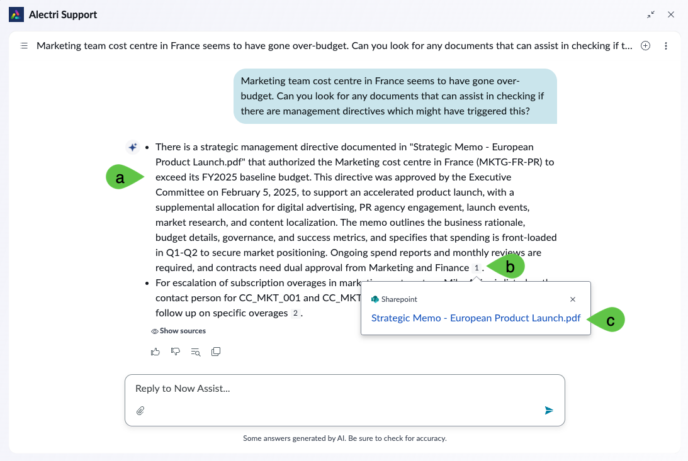<figcaption></figcaption></figure>

16. You will be directed to the file which has the content explaining why cost center **MKTG-FR-PR** went over-budget. You might be required to provide login/credentials, so if you are executing this lab in a ServiceNow managed environment, credentials to access this document will be provided separately in the lab session for security purposes.

<figure>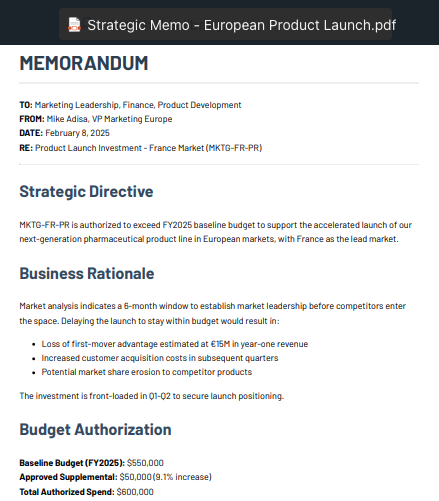<figcaption></figcaption></figure>

## Conclusion

Congratulations! You have completed configuration of the **External Content Connector** integration that allows ServiceNow read indexed unstructured documents to supplement unstructured data for both interactive and AI Agent-based workflows.

## Next step

Keeping with the unstructured data theme, you can explore an exercise that focuses on how ServiceNow gets unstructured data from documents and feed them into ServiceNow forms or records.

[Take me back to main page](../)
