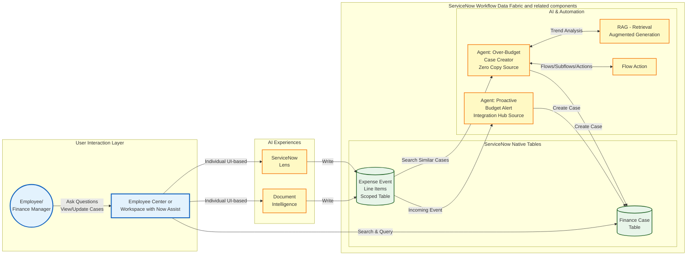

# Lab Exercise: ServiceNow  Document Intelligence and Lens

<mark style="color:red;">**Lab Exercise creation in progress!**</mark>

[Take me back to main page](./)

This lab will walk you through the configuration and usage of ServiceNow Lens and Document Intelligence as sources of unstructured document data for interactive and batch capture of expense information from documents.

**A note on this exercise:** In production, invoices are captured at the source: an ERP, procurement platform, or expense system, not uploaded directly into ServiceNow. ServiceNow's strength in this pattern is what happens _after_ ingestion: orchestrating validation against external data, enriching records via integration, and routing exceptions through case management. That's the capability we're demonstrating in most of the exercises in this lab.

To keep this exercise self-contained and reuse the agent built in [Lab Exercise: Integration Hub](https://servicenow-lf.gitbook.io/the-workflow-data-fabric-loom/lab-exercise-integration-hub), we upload the document to a task record and let Document Intelligence extract it locally. Once the document is extracted, everything downstream such as the agent calls, the cross-system lookups, and the case creation, works the same regardless of how the document arrived. The document upload through a task table is a stand-in for the real action that happens in an ERP system. This exercise is about what ServiceNow _does_ with the document and is not about how it _receives_ it.

A more detailed version of this exercise with significantly more configuration steps is available as standalone. Reach out to your Lab Administrator for more details.

## Data flow

The data flow below shows how ServiceNow will get information from documents from invoices and further process said information to evaluate whether a Finance case should be created.

### Document Intelligence Configuration

1.  Navigate to **All** > <mark style="color:green;">**a.)**</mark> type **Now Assist Admin** > <mark style="color:green;">**b.)**</mark> click on **Now Assist Admin > Skills**.

    <figure><figcaption></figcaption></figure>
2.  Go to <mark style="color:green;">**a.)**</mark> **Platform** > <mark style="color:green;">**b.)**</mark>**&#x20;Other** > <mark style="color:green;">**c.)**</mark> type **Extract information from documents** > <mark style="color:green;">**d.)**</mark> click **Activate Skill**.

    <figure><figcaption></figcaption></figure>
3.  Go to <mark style="color:green;">**a.)**</mark> **Create Usecase** > <mark style="color:green;">**b.)**</mark> click on **Expense Transaction Event.**

    <figure><figcaption></figcaption></figure>
4. In this screen, you do not have to configure anything as this has been preconfigured as a custom **use case** under the standard platform skill **Extract information from documents**. The sub-steps below only serve as a tour of the different configuration components for a Document Intelligence components.&#x20;

<mark style="color:green;">**a.)**</mark>**&#x20;Status: Active** indicates that this has been activated prior.

<mark style="color:green;">**b.)**</mark>**&#x20;Target table: Expense Transaction Event** is the table that will save the extracted information from the documents. This can be a standard or a custom table

<mark style="color:green;">**c.)**</mark>**&#x20;Full automation mode: On** indicates that this skill will automatically process and extract the information from uploaded documents. If [Document Intelligence Admin](https://store.servicenow.com/sn_appstore_store.do#!/store/application/8700f4efc3a411101d9a3cadb140ddad/1.1.0) is installed, the thresholds fore **Full automation** to trigger can be set for each use case. Our scenario does not have it installed so we will configure the thresholds for Full automation mode in the latter steps.

<mark style="color:green;">**d.)**</mark>**&#x20;Field Names** show all of the relevant fields for this use case, these have been preconfigured.

<mark style="color:green;">**e.)**</mark>**&#x20;Target fields** show the fields from the **Target table** where the extracted information will be saved in.

<mark style="color:green;">**f.)**</mark>**&#x20;Type** is where the data type can be configured. For this scenario we are using Text for all as Document Intelligence is capable of mapping this to the appropriate data type in the target table in most cases.

<mark style="color:green;">**g.)**</mark> **Required** can be configured to set whether a field is mandatory for the Document Intelligence extraction, i.e. a blank required field will result into the extraction not being saved into the target table.

<mark style="color:green;">**h.)**</mark>**&#x20;+ New field** allows addition of new fields for Document Intelligence to extract. No additional fields are needed for this scenario.

<mark style="color:green;">**i.)**</mark>**&#x20;Settings (gear icon)** allow you to toggle **Full Automation mode** and **Manage LLMs**.

<mark style="color:green;">**j.)**</mark> Go to **Integrations** tab.

<figure><figcaption></figcaption></figure>

5. In the integrations tab the following needs to be observed. The **Process** integration picks up the document from the source table and **Extract** integration extracts the contents of the document to be saved to the target table.

<mark style="color:green;">**a.)**</mark>**&#x20;Extract** integration should be present with the target table **x\_snc\_forecast\_v\_0\_expense\_transaction\_event (Expense Transaction Event)**.

<mark style="color:green;">**b.)**</mark>**&#x20;DocIntel Extract Values Flow - Expense Transaction Event - Extract** should be the Flow assigned. If it is not assigned, double click and type the name of the flow to assign it. This is a scoped Flow and is created specifically for this use case.

<mark style="color:green;">**c.)**</mark>**&#x20;Process** integration should be present with the target table **x\_snc\_forecast\_v\_0\_expense\_transaction\_event (Expense Transaction Event)**.

<mark style="color:green;">**d.)**</mark>**&#x20;DocIntel Task Processing Flow - Expense Transaction Event - Process** should be the Flow assigned. If it is not assigned, double click and type the name of the flow to assign it. This is a scoped Flow and is created specifically for this use case.

<mark style="color:green;">**e.)**</mark> If everything is correct, click **Exit**.

<figure><figcaption></figcaption></figure>

6. Click **Save and Continue**.&#x20;

<figure><figcaption></figcaption></figure>

5.  Click **Activate**.&#x20;

    <figure><figcaption></figcaption></figure>
6.  Click **Return to Platform**.&#x20;

    <figure><figcaption></figcaption></figure>
7. You will be redirected to the Skills screen and this concludes the walkthrough of the Skills needed for document extraction.

### Document Intelligence Runtime

1. Steps 2 to 4 are applicable if you do not have Document Intelligence Admin plugin installed which is the case for this lab. Succeeding versions of this lab will have the said plugin installed which will result in a more streamlined experience.
2.  For this step, change the scope to Global by navigating to the <mark style="color:green;">**a.)**</mark> **globe icon** and clicking <mark style="color:green;">**b.)**</mark> **Global** application scope.

    <figure><figcaption></figcaption></figure>
3. Navigate to All > <mark style="color:green;">**a.)**</mark> type **Document Data Extraction** > <mark style="color:green;">**b.)**</mark> click Document **Data Extraction > System Properties**.&#x20;

<figure><figcaption></figcaption></figure>

4. Search for <mark style="color:green;">**a.)**</mark> **\*threshold** and update the values of the three parameters below <mark style="color:green;">**b.)**</mark> to **0.01**. This is to reduce the threshold for the automation

<figure><figcaption></figcaption></figure>

3. Change the scope to Global by navigating to the <mark style="color:green;">**a.)**</mark> **globe icon** and <mark style="color:green;">**b.)**</mark> searching and/or clicking **Forecast Variance** application scope.

<figure><figcaption></figcaption></figure>

4. a
5. a
6. a
7. a

### Document Intelligence Runtime

1. Navigate to **All** > <mark style="color:green;">**a.)**</mark> type **Now Assist Admin** > <mark style="color:green;">**b.)**</mark> click on **Now Assist Admin > Skills**.

[Take me back to main page](./)
