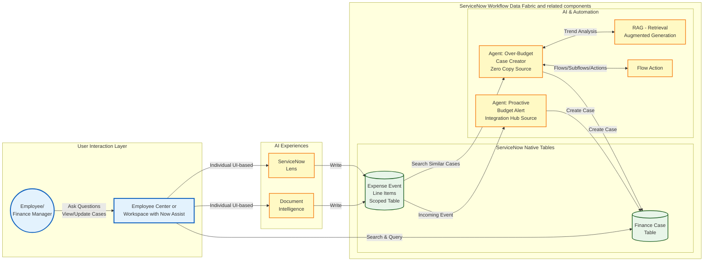

# Lab Exercise: ServiceNow Lens and Document Intelligence

<mark style="color:red;">**Lab Exercise creation in progress!**</mark>

[Take me back to main page](./)

This lab will walk you through the configuration and usage of ServiceNow Lens and Document Intelligence as sources of unstructured document data for interactive and batch capture of expense information from documents.

## Data flow

The data flow below shows how ServiceNow will get information from documents from invoices and further process said information to evaluate whether a Finance case should be created.

### Document Intelligence Configuration

1.  Navigate to **All** > <mark style="color:green;">**a.)**</mark> type **Now Assist Admin** > <mark style="color:green;">**b.)**</mark> click on **Now Assist Admin > Skills**.

    <figure><figcaption></figcaption></figure>
2.  Go to <mark style="color:green;">**a.)**</mark> **Platform** > <mark style="color:green;">**b.)**</mark>**&#x20;Other** > <mark style="color:green;">**c.)**</mark> type **Extract information from documents** > <mark style="color:green;">**d.)**</mark> click **Activate Skill**.

    <figure><figcaption></figcaption></figure>
3.  In the following screen, <mark style="color:green;">**a.)**</mark> put **Use case name** as **Extract Invoice Information** > <mark style="color:green;">**b.)**</mark>**&#x20;Target table** as **Expense Transaction Event**  > <mark style="color:green;">**c.)**</mark> leave everything else as is then click **Save and Continue**.&#x20;

    <figure><figcaption></figcaption></figure>
4.  Click **Add a field** in the screen that follows.&#x20;

    <figure><figcaption></figcaption></figure>
5.  Click **Field**.&#x20;

    <figure><figcaption></figcaption></figure>
6. Provide the following details for the first field:

<mark style="color:green;">**a.)**</mark>**&#x20;Field name: Vendor**

<mark style="color:green;">**b.)**</mark>**&#x20;Details: Vendor**

<mark style="color:green;">**c.)**</mark>**&#x20;Field type: Text**

<mark style="color:green;">**d.)**</mark>**&#x20;Target field: Vendor**

<mark style="color:green;">**e.)**</mark> Click **Save**

<figure><figcaption></figcaption></figure>

7. Do the same for the following rest:
   1. **Cost Center**
      1. **Field name: Cost Center**
      2. **Details: Cost Center**
      3. **Field type: Text**
      4. **Target field: Cost Center**
      5. Click **Save**
   2. **Amount USD**
      1. **Field name: Amount USD**
      2. **Details: Amount USD**
      3. **Field type: Decimal**
      4. **Target field: Amount USD**
      5. Click **Save**
8.  You should have a screen similar to below. Click **Save and Continue**.

    <figure><figcaption></figcaption></figure>
9.  Skip the testing for now as we will need to fine-tune some parameters later. Click **Save and Continue**.

    <figure><figcaption></figcaption></figure>
10. We do not need to add integrations for this use case. Click **Save and Continue**.

    <figure><figcaption></figcaption></figure>
11. Complete the setup, click **Complete setup**.

    <figure><figcaption></figcaption></figure>
12. Click **Return to use cases**.

    <figure><figcaption></figcaption></figure>
13. Click **Save and Continue**.

    <figure><figcaption></figcaption></figure>
14. Click **Save and Continue**.

    <figure><figcaption></figcaption></figure>
15. Click **Activate**.

    <figure><figcaption></figcaption></figure>
16. Click **Return to Platform**.&#x20;

    <figure><figcaption></figcaption></figure>
17. You will be redirected to the Skills screen so <mark style="color:green;">**a.)**</mark> search for **Extract information from documents** > <mark style="color:green;">**b.)**</mark> Click the **vertical three dot button** > <mark style="color:green;">**c.)**</mark> click **Edit**.&#x20;

    <figure><figcaption></figcaption></figure>
18. In the next screen, click **Extract Invoice Information**.

    <figure><figcaption></figcaption></figure>
19. In the screen that follows, click on the **settings icon**.

    <figure><figcaption></figcaption></figure>
20. Toggle <mark style="color:green;">**a.)**</mark> **Full automation mode**, then <mark style="color:green;">**b.)**</mark> click **Save**.

    <figure><figcaption></figcaption></figure>

### Document Intelligence Runtime

1. Steps 2 to 4 are applicable if you do not have Document Intelligence Admin plugin installed which is the case for this lab. Succeeding versions of this lab will have the said plugin installed which will result in a more streamlined experience.
2.  For this step, change the scope to Global by navigating to the <mark style="color:green;">**a.)**</mark> **globe icon** and clicking <mark style="color:green;">**b.)**</mark> **Global** application scope.

    <figure><figcaption></figcaption></figure>
3. Navigate to All > <mark style="color:green;">**a.)**</mark> type **Document Data Extraction** > <mark style="color:green;">**b.)**</mark> click Document **Data Extraction > System Properties**.&#x20;

<figure><figcaption></figcaption></figure>

4. Search for <mark style="color:green;">**a.)**</mark> **\*threshold** and update the values of the three parameters below <mark style="color:green;">**b.)**</mark> to **0.01**. This is to reduce the threshold for the automation

<figure><figcaption></figcaption></figure>

3. Change the scope to Global by navigating to the <mark style="color:green;">**a.)**</mark> **globe icon** and <mark style="color:green;">**b.)**</mark> searching and/or clicking **Forecast Variance** application scope.

<figure><figcaption></figcaption></figure>

4.
5. f
6. f

[Take me back to main page](./)
