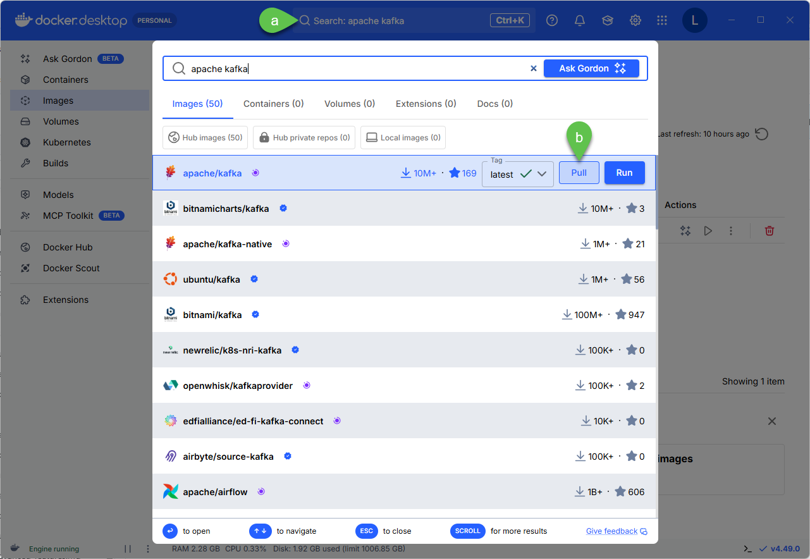
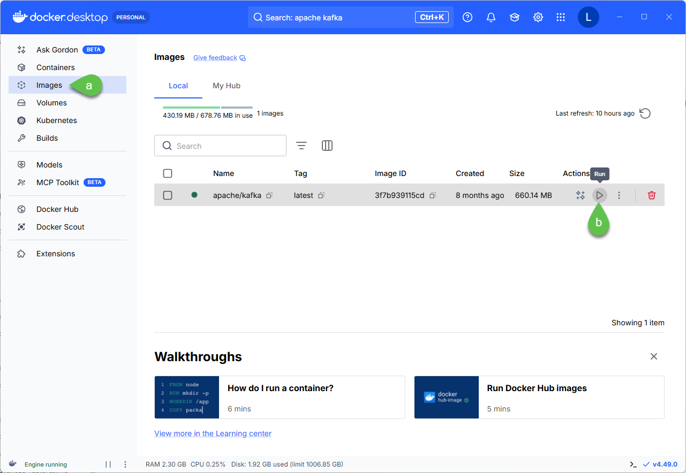
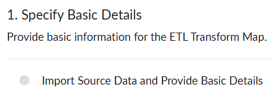

# Section 16: Kafka Stream Connect Lab Guide

### Pre-requisites - Mandatory:
1. This lab is for ServiceNow internal only
2. Ensure you are able to HOP to hermes1 via this URL: http://hihop.service-now.com/hop.do?sysparm_instance=hermes1&mode=readwrite

### Pre-requisites - Recommended:
This will reduce effort in building the Kafka Producer:
1. Get a Docker account which can be created for free via https://www.docker.com/
2. Install Docker Desktop via https://docs.docker.com/desktop/
3. Open Docker, search for apache/kafka latest image by using the **Search** bar then click **Pull**
   

4. Go to **Images**, **Run** the Docker Image, accept defaults

   

5. Go to Containers and see the newly created container with a randomized name; in the example below, it is vigilant_bartik and agitated_ardinghelli

   

6. This will be the image you will use for Part X. Alternatively you can execute all of the steps in Part X in your local machine


### Part 1: Creating a data source
1. Go to All > search for **Data Sources**


2. Click **New**


3. Fill in the details for:
- a. Name, put in a descriptive name like **CMDB Data Array [Your Initials]**
- b. Import set table label, this will populate the **Import set table name**
- c. Type, select **File**
- d. Format, select **JSON**
- e. Put in **Path for each row** the characters **//**
- f. Tick **Data in single column**

  

- g. Right click on the header and click **Save**

  

4. Create a JSON file which has the structure of the data source. You can use the text below and save the file as **cmdb complex data array.json**
```
[{
    "table_name": "cmdb_ci_win_server",
    "site_code": "swmw1",
    "hostname" : "ktesthostname",
    "action": "ADD",
    "sys_class_name":"cmdb_ci_win_server",
    "data": 
    {
        "name": "K3 Complex Server",
        "site_code": "swmw1",
        "class": "Media",
        "entity_type": "media",
        "entity_subtype": "",
        "media_type": "",
        "location_a": "wynnarma",
        "location_z": "wynnarma",
        "last_unit": "00036",
        "first_unit": "00001",
        "mco": "",
        "number_wires": "2",
        "facility_detail": "lg-lgss",
        "sec": "sw1t0001",
        "media_designation": "rd010102"
    }              
}]
```
5. Upload the JSON file you just created
- a. Select the clip icon
- b. Click **Choose file** and upload the file from your machine
    

6. Right click on the header and click Save

    

7. Under Related Links click on **Test Load 20 Records**

    

### Part 2: Creating the transformation (ETL)
1. Go to All > search for IntegrationHub ETL

   
   
2. In IntegrationHub ETL home screen, click Create new

    
    
3. Under Specify Basic Details, click on Import Source Data and Provide Basic Details

   
   
4. Fill in the screen Provide Basic Information for the ETL Transform Map
- a. CMDB Application, select CMDB Import
- b. Name, put in a descriptive name like CMDB Complex Nested <Your Initials>
- c. Data Source, select the data source you created in Part 1
- d. Sample Import Set should populate automatically; if it does not, click on the magnifying glass and click the first item
- e. Preview Size Override, set to 100
- f. Click Save then Mark as Complete
  
    
    
5. Under Prepare Source Data for Mapping, click on Preview and Prepare Data

    

6. Fill in the screen Provide Basic Information for the ETL Transform Map
- a. Verify that when clicking on object in the first node of the tree on the left that your fields are similar to the screen here. Sequence is not important.
    

- b. Verify that when click on in data in the third node on the tree to the left that your fields are similar to the screen here. This is a wide table so checking the first few fields is sufficient. Sequence is not important.
- c. Click Mark as Complete

    

7. Under Map to CMDB and Add Relationships, click Select CMDB Classes to Map Source Data

    

8. Click in Add Conditional Class

    

10. A new dialog will pop-up
- a. Collection, select object
- b. Under If field, select object.table_name is cmdb_ci_linux_server
- c. Under Then Class field, select Linux Server
- d. Click New Criteria (not in screenshot)
- e. Under If field, select object.table_name is cmdb_ci_win_server
- f. Under Then Class field, select Windows Server
- g. Click Save

    

9. Set up mapping for Linux Server 1

    
    
10. Fill up the details for Linux Server 1
- a. **Source Native Key** > **Source Column**, click on mapping button, type and select **hostname**

    

- b. **Name** > **Source Column**, click on mapping button, type **data.name**, click on data then click on **name**

   

- c. Using the same approach from the PREVIOUS screenshot, go to **Product instance identifier** > **Source Column**, click on mapping button, type **data.name**, click on data then click on **name**

- d. Using the same approach from the PREVIOUS screenshot, go to **Serial number** > **Source Column**, click on mapping button, type **data.site_code**, click on data then click on **site_code**
  
- e. The final output should be similar to below. Click back

   
  
10. Set up mapping for Windows Server 1
    
    
    
12. Do similar steps done for Linux Server 1 for Windows Server 1
- a. Source Native Key > Source Column, click on mapping button, type and select hostname
- b. Name > Source Column, click on mapping button, type data.name, click on data then click on name
- c. Product instance identifier > Source Column, click on mapping button, type data.name, click on data then click on name
- d. Serial number > Source Column, click on mapping button, type data.site_code, click on data then click on site_code
- e. The final output should be similar to below. Click back

   
  
11. Click Mark as Complete to finish Select CMDB Classes to Map Source Data

   

13. Under Map to CMDB and Add Relationships, click Add Relationships

    
   
13. Click Add Relationships
- a. Leave this blank; this is just to show the option to add Class Relationships if needed
- b. Click back

   

13. Under Preview Sample Integration Results and Schedule Import, Test and Rollback Integration Results


14. Run an integration test
- a. Click Run Integration

   

- b. You should see the results similar to below

   

- c. Click back then click **Perform Rollback**

   
   
14. Set up of ETL Transform Map is complete, click back
   

### Part 3: Setting up the consumer in Stream Connect


